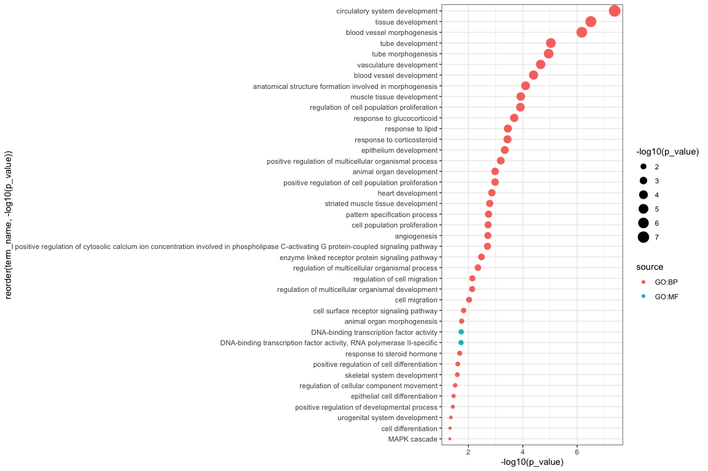

Pruning gprofiler2 results using the GO graph
================
Giuseppe D’Agostino
3/26/2021

Load necessary libraries

``` r
library(GO.db)
library(gprofiler2)
library(ggplot2)
library(AnnotationDbi)
library(SummarizedExperiment)
```

We load a `SummarizedExperiment` with differential expression results
from a publicly available mouse dataset (GSE111434) in which there is a
strong transcriptional effect.

``` r
o <- readRDS("DEA_GSE111434_KA.rds")
res <- rowData(o)$DEA.KA
head(res)
```

    ##           logFC   logCPM       LR PValue FDR
    ## Bdnf   2.804356 7.447483 2381.090      0   0
    ## Csrnp1 5.464516 6.133591 3503.743      0   0
    ## Pcdh8  3.189811 8.902041 1894.224      0   0
    ## Errfi1 2.728258 7.047022 2317.805      0   0
    ## Bcor   2.966445 7.362972 3226.355      0   0
    ## Nptx2  4.108360 8.024149 2959.973      0   0

We retain only interesting genes, i.e. thresholding on absolute
log2(fold change) upon kainic acid treatment \> 1 and FDR-adgusted
p-values below 0.01. This will be our query set. The background set,
instead, will be the whole set of genes in the results table. This table
has already been filtered, so that all these genes are expressed at a
baseline level.

``` r
par(mar = c(10,4,1,1))
boxplot(log(assay(o, "counts") + 1), las = 2) # all genes are expressed
```

<!-- -->

``` r
sig_genes <- rownames(res[abs(res$logFC) > 1 & res$FDR < 0.01,])
```

We use the `gost` function from `gprofiler2`(Raudvere et al. 2019) to
perform over-representation analysis on the GO genesets.

``` r
go_ora <- gost(query = sig_genes, 
                organism = "mmusculus",
                significant = FALSE,
                user_threshold = 0.05, 
                correction_method = "g_SCS", 
                domain_scope = "custom", 
                custom_bg = rownames(res), 
                sources = "GO")
```

The pruning function is very simple and uses `GO.db` to access the GO
DAG (directed acyclic graph).

It performs a series of operations on GO results:

  - keeps significant (nominal p value) terms that have no children

  - for non-significant terms, only keeps those that have no children

  - if a term is significant but has at least a significant child, it is
    removed

  - if a term is significant but has a non-significant child, it is kept

<!-- end list -->

``` r
pruneGO_GOST <- function(gost_res, 
                          go_sub = c("BP", "MF", "CC"),
                          alpha = 0.05){
  
  gost_res <- gost_res[which(gost_res$source == paste0("GO:", go_sub)),]
  
  if(go_sub == "BP") go_subcategory = GOBPCHILDREN 
  
  else  if(go_sub == "MF") go_subcategory = GOMFCHILDREN
  
  else  if(go_sub == "CC") go_subcategory = GOCCCHILDREN 
  
  go_children <- as.list(go_subcategory)
  
  go_haschildren <- go_children[!is.na(go_children)]
  
  gost_res$has_children <- sapply(gost_res$term_id, function(x) x %in% names(go_haschildren))
  
  gost_res_sig <- gost_res[gost_res$p_value < alpha,]
  
  gost_res_sig$has_sig_children <- sapply(gost_res_sig$term_id, 
                                           function(x) any(go_haschildren[[x]] %in% gost_res_sig$term_id))
  
  gost_res_sig$keep <- (gost_res_sig$has_children == FALSE) | (gost_res_sig$has_children == TRUE & gost_res_sig$has_sig_children == FALSE) 
  
  gost_res_ns_childless <- gost_res[which(gost_res$p_value >= alpha & !gost_res$has_children),]
  
  pruned <- rbind(gost_res_sig[gost_res_sig$keep,1:14], gost_res_ns_childless[,1:14])

  pruned_len <- length(setdiff(pruned$term_id, gost_res_sig$term_id))
  
  message("Pruned ", pruned_len, " terms.")
  
  return(pruned)
}
```

We apply the function to our GO over-representation results. Since every
subcategory has its own DAG, we need to apply it separately to each
subcategory.

``` r
go_ora_bp_pruned <- pruneGO_GOST(go_ora$result, go_sub = "BP", alpha = 0.05)
```

    ## Pruned 1537 terms.

``` r
go_ora_mf_pruned <- pruneGO_GOST(go_ora$result, go_sub = "MF", alpha = 0.05)
```

    ## Pruned 994 terms.

``` r
go_ora_cc_pruned <- pruneGO_GOST(go_ora$result, go_sub = "CC", alpha = 0.05)
```

    ## Pruned 398 terms.

Results are merged. We do not perform any additional correction on the
p-values, because they were already calculated through the gSCS method
implemented by `gprofiler2`. This method already takes into account the
DAG structure for multiple test correction, yet it does not remove
parent terms if they are significant.

``` r
go_ora_all_pruned <- rbind(go_ora_bp_pruned[order(go_ora_bp_pruned$p_value, decreasing = FALSE),], 
                           go_ora_mf_pruned[order(go_ora_mf_pruned$p_value, decreasing = FALSE),], 
                           go_ora_cc_pruned[order(go_ora_cc_pruned$p_value, decreasing = FALSE),])
```

Selecting significant (adjusted p value) results:

``` r
go_ora_all_pruned <- as.data.frame(go_ora_all_pruned)
go_ora_all_pruned_sig <- go_ora_all_pruned[go_ora_all_pruned$p_value < 0.05,]
```

Plot significant terms (ranked by p value)

``` r
ggplot(go_ora_all_pruned_sig, aes(x = reorder(term_name, -log10(p_value)), y = -log10(p_value), col = source )) + 
  geom_point(aes(size = -log10(p_value))) + 
  coord_flip() + 
  theme_bw()
```

<!-- -->

Significant results in non-pruned table:

``` r
go_ora_sig <- go_ora$result[go_ora$result$p_value < 0.05,]

ggplot(go_ora_sig, aes(x = reorder(term_name, -log10(p_value)), y = -log10(p_value), col = source )) + 
  geom_point(aes(size = -log10(p_value))) + 
  coord_flip() + 
  theme_bw()
```

<!-- -->

There are many vague terms regarding organismal and tissue development
in the non-pruned significant results.

``` r
sessionInfo()
```

    ## R version 4.0.4 (2021-02-15)
    ## Platform: x86_64-apple-darwin17.0 (64-bit)
    ## Running under: macOS Big Sur 10.16
    ## 
    ## Matrix products: default
    ## BLAS:   /Library/Frameworks/R.framework/Versions/4.0/Resources/lib/libRblas.dylib
    ## LAPACK: /Library/Frameworks/R.framework/Versions/4.0/Resources/lib/libRlapack.dylib
    ## 
    ## locale:
    ## [1] en_US.UTF-8/en_US.UTF-8/en_US.UTF-8/C/en_US.UTF-8/en_US.UTF-8
    ## 
    ## attached base packages:
    ## [1] parallel  stats4    stats     graphics  grDevices utils     datasets 
    ## [8] methods   base     
    ## 
    ## other attached packages:
    ##  [1] SummarizedExperiment_1.20.0 GenomicRanges_1.42.0       
    ##  [3] GenomeInfoDb_1.26.2         MatrixGenerics_1.2.1       
    ##  [5] matrixStats_0.58.0          ggplot2_3.3.3              
    ##  [7] gprofiler2_0.2.0            GO.db_3.12.1               
    ##  [9] AnnotationDbi_1.52.0        IRanges_2.24.1             
    ## [11] S4Vectors_0.28.1            Biobase_2.50.0             
    ## [13] BiocGenerics_0.36.0        
    ## 
    ## loaded via a namespace (and not attached):
    ##  [1] Rcpp_1.0.6             lattice_0.20-41        tidyr_1.1.3           
    ##  [4] assertthat_0.2.1       digest_0.6.27          utf8_1.1.4            
    ##  [7] R6_2.5.0               RSQLite_2.2.3          evaluate_0.14         
    ## [10] highr_0.8              httr_1.4.2             pillar_1.5.0          
    ## [13] zlibbioc_1.36.0        rlang_0.4.10           lazyeval_0.2.2        
    ## [16] data.table_1.14.0      blob_1.2.1             Matrix_1.3-2          
    ## [19] rmarkdown_2.7          labeling_0.4.2         stringr_1.4.0         
    ## [22] htmlwidgets_1.5.3      RCurl_1.98-1.2         bit_4.0.4             
    ## [25] munsell_0.5.0          DelayedArray_0.16.2    compiler_4.0.4        
    ## [28] xfun_0.21              pkgconfig_2.0.3        htmltools_0.5.1.1     
    ## [31] tidyselect_1.1.0       tibble_3.1.0           GenomeInfoDbData_1.2.4
    ## [34] fansi_0.4.2            viridisLite_0.3.0      crayon_1.4.1          
    ## [37] dplyr_1.0.4            withr_2.4.1            bitops_1.0-6          
    ## [40] grid_4.0.4             jsonlite_1.7.2         gtable_0.3.0          
    ## [43] lifecycle_1.0.0        DBI_1.1.1              magrittr_2.0.1        
    ## [46] scales_1.1.1           stringi_1.5.3          cachem_1.0.4          
    ## [49] farver_2.1.0           XVector_0.30.0         ellipsis_0.3.1        
    ## [52] generics_0.1.0         vctrs_0.3.6            tools_4.0.4           
    ## [55] bit64_4.0.5            glue_1.4.2             purrr_0.3.4           
    ## [58] fastmap_1.1.0          yaml_2.2.1             colorspace_2.0-0      
    ## [61] memoise_2.0.0          plotly_4.9.3           knitr_1.31

## References

<div id="refs" class="references">

<div id="ref-godb">

Calrson, Marc. n.d. “GO.db - A Set of Annotation Maps Describing the
Entire Gene Ontology. R Package Version 3.8.2.” *Bioconductor*.
<https://bioconductor.org/packages/GO.db>.

</div>

<div id="ref-se">

Morgan, Martin, Valerie Obenchain, Jim Hester, and Hervé Pagès. n.d.
“SummarizedExperiment - SummarizedExperiment Container. R Package
Version 1.20.0.” *Bioconductor*.
<https://bioconductor.org/packages/SummarizedExperiment>.

</div>

<div id="ref-annotationdbi">

Pagès, Hervé, Marc Calrson, Seth Falcon, and Nianhua Li. n.d.
“AnnotationDbi - Manipulation of SQLite-Based Annotations in
Bioconductor. R Package Version 1.52.0.” *Bioconductor*.
<https://bioconductor.org/packages/AnnotationDbi>.

</div>

<div id="ref-gpr">

Raudvere, Uku, Liis Kolberg, Ivan Kuzmin, Tambet Arak, Priit Adler, Hedi
Peterson, and Jaak Vilo. 2019. “gProfiler - a Web Server for Functional
Enrichment Analysis and Conversions of Gene Lists.” *Nucleic Acids
Research*. <https://doi.org/10.1093/nar/gkz369>.

</div>

</div>
