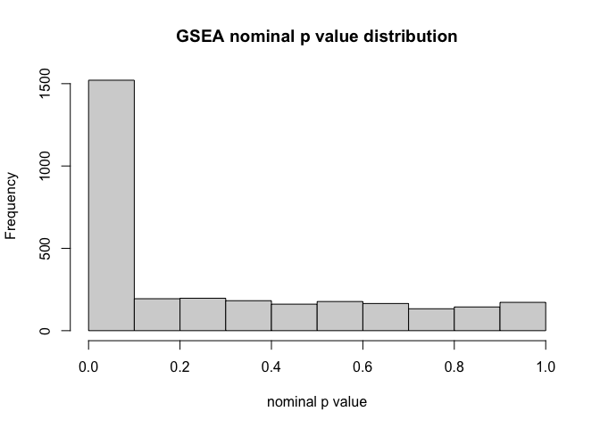
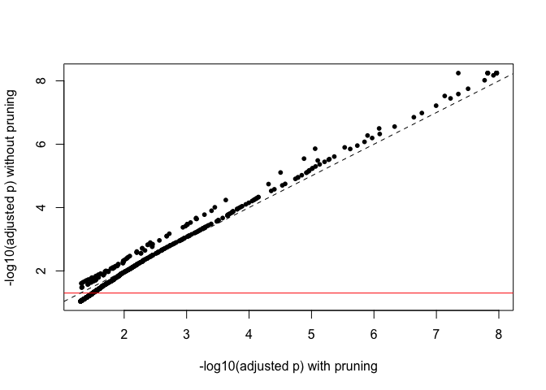
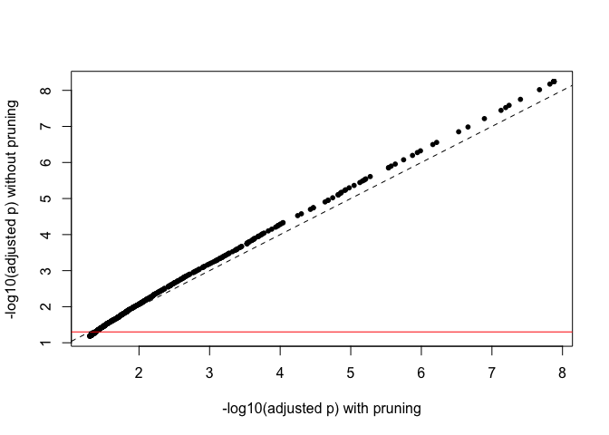
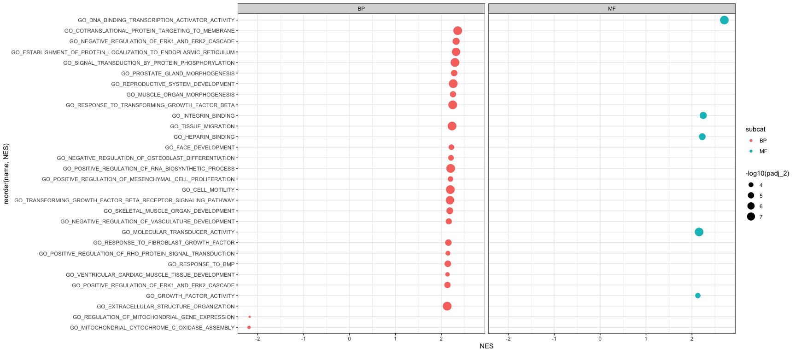
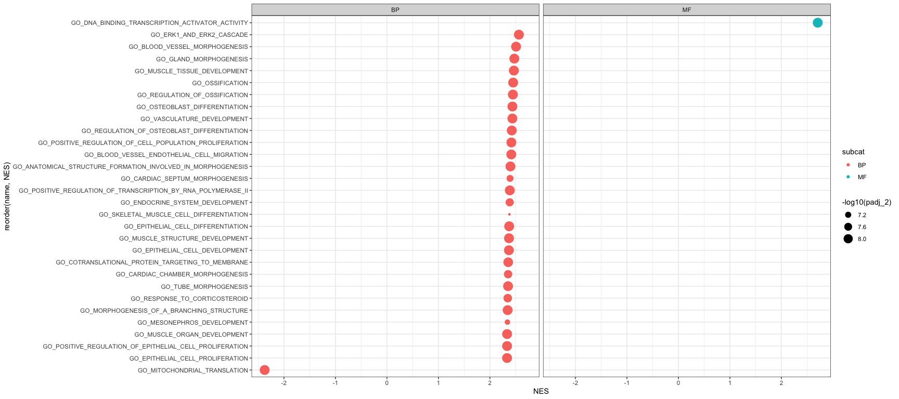
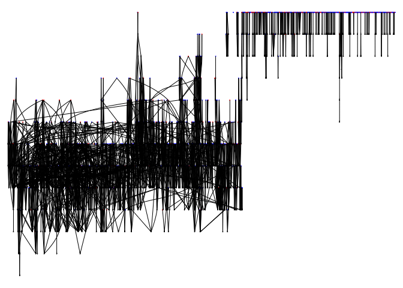
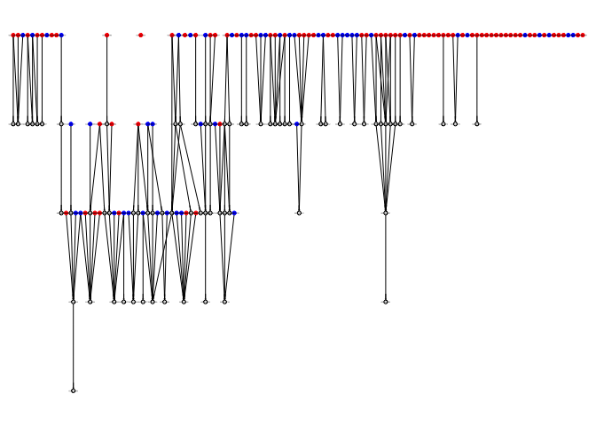
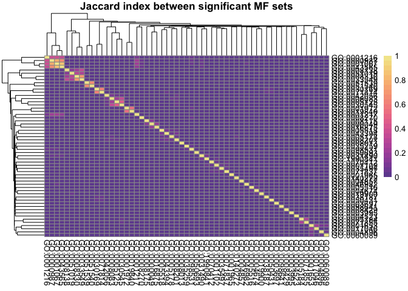
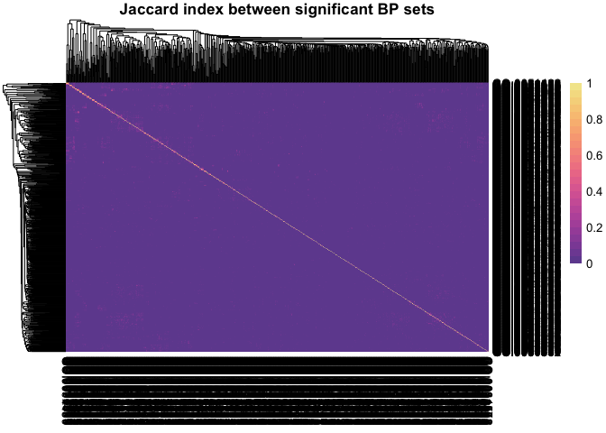
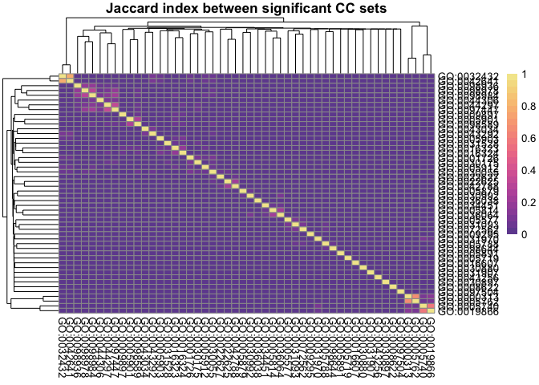

Pruning fgsea results using the GO graph
================
Giuseppe D’Agostino
2/25/2021

Load necessary libraries

``` r
library(GO.db)
library(fgsea)
library(BiocParallel)
library(msigdbr)
library(tidyverse)
library(ggplot2)
library(AnnotationDbi)
library(igraph)
library(Rgraphviz)
library(biomaRt)
library(pheatmap)
library(colorspace)
library(SummarizedExperiment)
```

We load a `SummarizedExperiment` with differential expression results
from a publicly available mouse dataset (GSE111434) in which there is a
strong transcriptional effect.

``` r
o <- readRDS("DEA_GSE111434_KA.rds")
res <- rowData(o)$DEA.KA
head(res)
```

    ##           logFC   logCPM       LR PValue FDR
    ## Bdnf   2.804356 7.447483 2381.090      0   0
    ## Csrnp1 5.464516 6.133591 3503.743      0   0
    ## Pcdh8  3.189811 8.902041 1894.224      0   0
    ## Errfi1 2.728258 7.047022 2317.805      0   0
    ## Bcor   2.966445 7.362972 3226.355      0   0
    ## Nptx2  4.108360 8.024149 2959.973      0   0

We load the MGI gene symbols to entrez id conversion table.

``` r
mart <- useMart("ensembl", dataset = "mmusculus_gene_ensembl")
entrezbm <- getBM(attributes=c("ensembl_gene_id", "mgi_symbol","entrezgene_id"), mart = mart)
entrezbm <- entrezbm[!duplicated(entrezbm$mgi_symbol),]
rownames(entrezbm) <- entrezbm$mgi_symbol
```

Ranking genes by log2(fold change) upon kainic acid treatment as an
input to `fgsea` (Korotkevich et al. 2021).

``` r
res$entrezgene_id <- entrezbm[rownames(res), "entrezgene_id"]

stat_ranks_frame <- as.data.frame(res) %>% 
  dplyr::select(entrezgene_id, logFC) %>% 
  na.omit() %>% 
  distinct() %>% 
  group_by(entrezgene_id) %>% 
  summarize(stat=mean(logFC))

stat_ranks <- deframe(stat_ranks_frame)
```

We use `msigdbr` to retrieve the C5 geneset (Gene Ontology), and we
format it to create a suitable input for `fgsea`. It is important to
retain the pathway name as the GO id.

``` r
go.genesets <- msigdbr(species = "Mus musculus", category = "C5")
go.genesets = as.data.frame(go.genesets)
go.genesets$entrez_gene = as.character(go.genesets$entrez_gene)
go.list <- lapply(unique(go.genesets$gs_name), function(x) go.genesets[go.genesets$gs_name == x, "entrez_gene"])
names(go.list) = unique(go.genesets$gs_exact_source)  ##IMPORTANT: use gs_exact_source to retain the GO ID
```

Running `fgsea` using standard parameters and parallelization.

``` r
set.seed(69420)

res_gsea <- fgsea(pathways = go.list, 
                      stats = stat_ranks,
                      BPPARAM = SnowParam())
```

    ## Warning in fgseaMultilevel(...): For some pathways, in reality P-values are less
    ## than 1e-10. You can set the `eps` argument to zero for better estimation.

Formatting the `fgsea` result to include GO ID, subcategory (important
for later) and pathway names.

We remove the HP ontology and recalculate adjusted p values using the
FDR method.

``` r
goid_to_name <- as.data.frame(cbind(unique(go.genesets$gs_exact_source), unique(go.genesets$gs_name)))
goid_and_subcat <- as.data.frame(unique(go.genesets[,c("gs_subcat", "gs_exact_source")]))
rownames(goid_and_subcat) <- goid_and_subcat$gs_exact_source
colnames(goid_to_name) <- c("GO_ID", "name")
rownames(goid_to_name) <- goid_to_name$GO_ID
goid_to_name$subcat <- goid_and_subcat[rownames(goid_and_subcat), "gs_subcat"]

res_gsea$name <- goid_to_name[res_gsea$pathway, "name"]
res_gsea$subcat <- goid_to_name[res_gsea$pathway, "subcat"]
res_gsea$subcat <- gsub(res_gsea$subcat, pattern = "GO:", replacement = "")

res_gsea <- res_gsea[res_gsea$subcat != "HPO"] # we remove HP terms because they are not in the GO graph
res_gsea$padj <- p.adjust(res_gsea$pval, method = "fdr")
```

The pruning function is very simple and uses `GO.db` to access the GO
DAG (directed acyclic graph).

It performs a series of operations on GSEA results:

  - keeps significant (nominal p value) terms that have no children

  - for non-significant terms, only keeps those that have no children

  - if a term is significant but has at least a significant child, it is
    removed

  - if a term is significant but has a non-significant child, it is kept

<!-- end list -->

``` r
pruneGO_FGSEA <- function(fgsea_res, 
                         go_sub = c("BP", "MF", "CC"),
                         alpha = 0.05){
  
  fgsea_res <- fgsea_res[which(fgsea_res$subcat == go_sub),]

  if(go_sub == "BP") go_subcategory = GOBPCHILDREN 
    else  if(go_sub == "MF") go_subcategory = GOMFCHILDREN
    else  if(go_sub == "CC") go_subcategory = GOCCCHILDREN 
  
  go_children <- as.list(go_subcategory)
  go_haschildren <- go_children[!is.na(go_children)]
  
  fgsea_res$has_children <- sapply(fgsea_res$pathway, function(x) x %in% names(go_haschildren))

  fgsea_res_sig <- fgsea_res[fgsea_res$pval < alpha,]

  fgsea_res_sig$has_sig_children <- sapply(fgsea_res_sig$pathway, 
                                            function(x) any(go_haschildren[[x]] %in% fgsea_res_sig$pathway))
   
  fgsea_res_sig$keep <- (fgsea_res_sig$has_children == FALSE) | (fgsea_res_sig$has_children == TRUE & fgsea_res_sig$has_sig_children == FALSE) 
  
  fgsea_res_ns_childless <- fgsea_res[which(fgsea_res$pval >= alpha & !fgsea_res$has_children),]

  pruned <- rbind(fgsea_res_sig[fgsea_res_sig$keep,1:11], fgsea_res_ns_childless[,1:11])
  
  pruned$padj_2 <- p.adjust(pruned$pval, method = "fdr")
  
  pruned_len <- length(setdiff(pruned$pathway, fgsea_res_sig$pathway))
  message("Pruned ", pruned_len, " terms.")
  
  return(pruned)
  
 }
```

We apply the function to our GSEA results. Since every subcategory has
its own DAG, we need to apply it separately to each subcategory.

``` r
res_gsea_bp_pruned <- pruneGO_FGSEA(res_gsea, go_sub = "BP", alpha = 0.05)
```

    ## Pruned 778 terms.

``` r
res_gsea_mf_pruned <- pruneGO_FGSEA(res_gsea, go_sub = "MF", alpha = 0.05)
```

    ## Pruned 568 terms.

``` r
res_gsea_cc_pruned <- pruneGO_FGSEA(res_gsea, go_sub = "CC", alpha = 0.05)
```

    ## Pruned 321 terms.

Results are merged. FDR-adjusted p values can be recomputed on the whole
table. This is probably aggressive, as we could consider each
DAG/subcategory as an independent experiment. We save this more
aggressive adjustment as a separate column.

``` r
res_gsea_all_pruned <- rbind(res_gsea_bp_pruned, res_gsea_mf_pruned, res_gsea_cc_pruned)
res_gsea_all_pruned$padj_3 <- p.adjust(res_gsea_all_pruned$pval, method = 'fdr')
```

We check the nominal p value histogram as a sanity check: we did not
alter the distribution.

``` r
hist(res_gsea_all_pruned$pval, xlab = "nominal p value", main = "GSEA nominal p value distribution")
```

<!-- -->

Selecting significant (adjusted p value) results:

``` r
res_gsea_all_pruned <- as.data.frame(res_gsea_all_pruned)
rownames(res_gsea_all_pruned) <- res_gsea_all_pruned$pathway
res_gsea_all_pruned_sig <- res_gsea_all_pruned[res_gsea_all_pruned$padj_2 < 0.05,]
```

How many significant terms did we recover? We compare the FDR values in
the original results table to the pruned one. Any significant term that
was not initially below the threshold (arbitrarily set at 0.05, above
the red line in the plot) but is now below threshold in the pruned
table, is a “recovered term”. Some of these “recovered terms” really
benefit from this procedure, as they have very low adjusted p-values
which would not have been reported as significant in the non-pruned
table. However, this is most likely due to the fact that we split the
results in 3 sub-categories and performed correction independently.

``` r
res_gsea <- as.data.frame(res_gsea)
rownames(res_gsea) <- res_gsea$pathway

plot(x = -log10(res_gsea_all_pruned_sig$padj_2), y = -log10(res_gsea[rownames(res_gsea_all_pruned_sig) ,"padj"]),
     pch = 16,
     cex = 0.8,
     ylab = "-log10(adjusted p) without pruning",
     xlab = "-log10(adjusted p) with pruning")

abline(h = -log10(0.05), col = 'red')
abline(0, 1, lty = 2)
```

<!-- -->

``` r
cat("Number of recovered terms: ", nrow(res_gsea_all_pruned_sig) -  length(which(res_gsea[res_gsea$pathway %in% res_gsea_all_pruned_sig$pathway,"padj"] < 0.05)))
```

    ## Number of recovered terms:  250

If we apply the more stringent FDR correction, we can see how the number
of recovered terms is smaller:

``` r
res_gsea_all_pruned_sig_2 <- res_gsea_all_pruned[res_gsea_all_pruned$padj_3 < 0.05,]


plot(x = -log10(res_gsea_all_pruned_sig_2$padj_3), y =  -log10(res_gsea[rownames(res_gsea_all_pruned_sig_2) ,"padj"]),
     pch = 16,
     cex = 0.8,
     ylab = "-log10(adjusted p) without pruning",
     xlab = "-log10(adjusted p) with pruning")

abline(h = -log10(0.05), col = 'red')
abline(0, 1, lty = 2)
```

<!-- -->

``` r
cat("Number of recovered terms: ", nrow(res_gsea_all_pruned_sig_2) -  length(which(res_gsea[res_gsea$pathway %in% res_gsea_all_pruned_sig_2$pathway,"padj"] < 0.05)))
```

    ## Number of recovered terms:  136

Top 30 terms (ranked by adjusted p value)

``` r
fgsea_top30 <- res_gsea_all_pruned_sig[order(abs(res_gsea_all_pruned_sig$NES), decreasing = TRUE)[1:30],]

ggplot(fgsea_top30, aes(x = reorder(name, NES), y = NES, col = subcat )) + 
  geom_point(aes(size = -log10(padj_2))) + 
  coord_flip() + 
  facet_wrap(~subcat) +
  theme_bw()
```

<!-- -->

Top 30 in the non-pruned table:

``` r
 res_gsea$padj_2 <- p.adjust(res_gsea$pval, method = "fdr")
 res_gsea_sig <-  res_gsea[ res_gsea$padj_2 < 0.05,]
fgsea_top30_nonpruned <- res_gsea_sig[order(abs(res_gsea_sig$NES), decreasing = TRUE)[1:30],]

ggplot(fgsea_top30_nonpruned, aes(x = reorder(name, NES), y = NES, col = subcat )) + 
  geom_point(aes(size = -log10(padj_2))) + 
  coord_flip() + 
  facet_wrap(~subcat) +
  theme_bw()
```

<!-- -->

There are many overlapping terms regarding skeletal development,
including vague ones, in the non-pruned significant results.

As a last check, did the pruning algorithm actually work? We draw the
induced DAGs using as inducing set the significant (nominal p value)
terms in the unpruned table, marking in red the terms retained in the
pruned table and in blue the pruned terms that are significant after FDR
correction. We want to make sure that the only blue/red nodes are
categories with no children. DAGs are retrieved through the
`makeGOgraph` function from `AnnotationDbi` , wrangled through `igraph`
and rendered using `Rgraphviz` .

``` r
graph.par(list(nodes=list(fontsize=40)))

res_gsea_sig_nominal <- res_gsea[res_gsea$pval < 0.05,]
res_gsea_mf_pruned_sig <- res_gsea_mf_pruned[res_gsea_mf_pruned$padj_2 < 0.05,]

mfgraph <- igraph::graph_from_graphnel(makeGOGraph("mf")) 
mfgraph_induced <- igraph::subgraph(mfgraph, v = which(names(V(mfgraph)) %in% res_gsea_sig_nominal$pathway))
```

    ## Warning in igraph::subgraph(mfgraph, v = which(names(V(mfgraph)) %in%
    ## res_gsea_sig_nominal$pathway)): At structural_properties.c:1984 :igraph_subgraph
    ## is deprecated from igraph 0.6, use igraph_induced_subgraph instead

``` r
mfgraphnel <- igraph::igraph.to.graphNEL(mfgraph_induced)
mfgraphnel <- layoutGraph(mfgraphnel)
nodeRenderInfo(mfgraphnel)$fill[res_gsea_mf_pruned$pathway] <- 'red' 
nodeRenderInfo(mfgraphnel)$col[res_gsea_mf_pruned$pathway] <- 'red' 
nodeRenderInfo(mfgraphnel)$fill[res_gsea_mf_pruned_sig$pathway] <- 'blue' 
nodeRenderInfo(mfgraphnel)$col[res_gsea_mf_pruned_sig$pathway] <- 'blue' 
renderGraph(mfgraphnel)
```

<!-- -->

``` r
res_gsea_bp_pruned_sig <- res_gsea_bp_pruned[res_gsea_bp_pruned$padj_2 < 0.05,]

bpgraph <- igraph::graph_from_graphnel(makeGOGraph("bp")) 
bpgraph_induced <- igraph::subgraph(bpgraph, v = which(names(V(bpgraph)) %in% res_gsea_sig_nominal$pathway))
```

    ## Warning in igraph::subgraph(bpgraph, v = which(names(V(bpgraph)) %in%
    ## res_gsea_sig_nominal$pathway)): At structural_properties.c:1984 :igraph_subgraph
    ## is deprecated from igraph 0.6, use igraph_induced_subgraph instead

``` r
bpgraphnel <- igraph::igraph.to.graphNEL(bpgraph_induced)
bpgraphnel <- layoutGraph(bpgraphnel)
nodeRenderInfo(bpgraphnel)$fill[res_gsea_bp_pruned$pathway] <- 'red' 
nodeRenderInfo(bpgraphnel)$col[res_gsea_bp_pruned$pathway] <- 'red' 
nodeRenderInfo(bpgraphnel)$fill[res_gsea_bp_pruned_sig$pathway] <- 'blue' 
nodeRenderInfo(bpgraphnel)$col[res_gsea_bp_pruned_sig$pathway] <- 'blue' 
renderGraph(bpgraphnel)
```

<!-- -->

``` r
res_gsea_cc_pruned_sig <- res_gsea_cc_pruned[res_gsea_cc_pruned$padj_2 < 0.05,]

ccgraph <- igraph::graph_from_graphnel(makeGOGraph("cc")) 
ccgraph_induced <- igraph::subgraph(ccgraph, v = which(names(V(ccgraph)) %in% res_gsea_sig_nominal$pathway))
```

    ## Warning in igraph::subgraph(ccgraph, v = which(names(V(ccgraph)) %in%
    ## res_gsea_sig_nominal$pathway)): At structural_properties.c:1984 :igraph_subgraph
    ## is deprecated from igraph 0.6, use igraph_induced_subgraph instead

``` r
ccgraphnel <- igraph::igraph.to.graphNEL(ccgraph_induced)
ccgraphnel <- layoutGraph(ccgraphnel)
nodeRenderInfo(ccgraphnel)$fill[res_gsea_cc_pruned$pathway] <- 'red' 
nodeRenderInfo(ccgraphnel)$col[res_gsea_cc_pruned$pathway] <- 'red' 
nodeRenderInfo(ccgraphnel)$fill[res_gsea_cc_pruned_sig$pathway] <- 'blue' 
nodeRenderInfo(ccgraphnel)$col[res_gsea_cc_pruned_sig$pathway] <- 'blue' 
renderGraph(ccgraphnel)
```

<!-- -->

Even though the significant sets are now the most specific ones, some
overlaps may still be present. This is a potential issue, as discussed
in the `setRank` paper (Simillion et al. 2017). We check whether this is
the case and to which extent these sets overlap plotting the matrix of
pairwise Jaccard indices:

``` r
sig_mf_setlist <- go.list[res_gsea_mf_pruned_sig$pathway]

mf_pairwise <- as.data.frame(expand.grid(names(sig_mf_setlist), names(sig_mf_setlist)))

mf_pairwise$jaccard <- apply(mf_pairwise, 1, function(x) length(intersect(sig_mf_setlist[[x[1]]], sig_mf_setlist[[x[2]]])) / length(union(sig_mf_setlist[[x[1]]], sig_mf_setlist[[x[2]]])))
         
jacmat_mf <- matrix(mf_pairwise$jaccard, nrow = length(sig_mf_setlist), byrow = TRUE)
rownames(jacmat_mf) <- names(sig_mf_setlist)
colnames(jacmat_mf) <- names(sig_mf_setlist)

pheatmap(jacmat_mf, 
        cluster_cols = TRUE, 
        cluster_rows = TRUE,
        col = colorspace::sequential_hcl("Sunset", n = 25),
        main = "Jaccard index between significant MF sets")
```

<!-- -->

``` r
sig_bp_setlist <- go.list[res_gsea_bp_pruned_sig$pathway]

bp_pairwise <- as.data.frame(expand.grid(names(sig_bp_setlist), names(sig_bp_setlist)))

bp_pairwise$jaccard <- apply(bp_pairwise, 1, function(x) length(intersect(sig_bp_setlist[[x[1]]], sig_bp_setlist[[x[2]]])) / length(union(sig_bp_setlist[[x[1]]], sig_bp_setlist[[x[2]]])))
         
jacmat_bp <- matrix(bp_pairwise$jaccard, nrow = length(sig_bp_setlist), byrow = TRUE)
rownames(jacmat_bp) <- names(sig_bp_setlist)
colnames(jacmat_bp) <- names(sig_bp_setlist)

pheatmap(jacmat_bp, 
        cluster_cols = TRUE, 
        cluster_rows = TRUE,
        col = colorspace::sequential_hcl("Sunset", n = 25),
        main = "Jaccard index between significant BP sets")
```

<!-- -->

``` r
sig_cc_setlist <- go.list[res_gsea_cc_pruned_sig$pathway]

cc_pairwise <- as.data.frame(expand.grid(names(sig_cc_setlist), names(sig_cc_setlist)))

cc_pairwise$jaccard <- apply(cc_pairwise, 1, function(x) length(intersect(sig_cc_setlist[[x[1]]], sig_cc_setlist[[x[2]]])) / length(union(sig_cc_setlist[[x[1]]], sig_cc_setlist[[x[2]]])))
         
jacmat_cc<- matrix(cc_pairwise$jaccard, nrow = length(sig_cc_setlist), byrow = TRUE)
rownames(jacmat_cc) <- names(sig_cc_setlist)
colnames(jacmat_cc) <- names(sig_cc_setlist)

pheatmap(jacmat_cc, 
        cluster_cols = TRUE, 
        cluster_rows = TRUE,
        col = colorspace::sequential_hcl("Sunset", n = 25),
        main = "Jaccard index between significant CC sets")
```

<!-- -->

Although the overlaps seem to be few, they are present and we must
acknowledge them. Overlaps make it slightly more difficult to define how
specifically enriched a set is compared to another. A simple argument is
that both sets are being regulated at the same time (since sets are
somewhat arbitrarily defined). For instance, two significant sets that
are highly overlapping in the CC subcategory are “Actin filament bundle”
and “Actomyosin”. Although they are in different parts of the DAG, they
overlap and most likely are both regulated, especially considering how
molecularly similar they are.

``` r
sessionInfo()
```

    ## R version 4.0.4 (2021-02-15)
    ## Platform: x86_64-apple-darwin17.0 (64-bit)
    ## Running under: macOS Big Sur 10.16
    ## 
    ## Matrix products: default
    ## BLAS:   /Library/Frameworks/R.framework/Versions/4.0/Resources/lib/libRblas.dylib
    ## LAPACK: /Library/Frameworks/R.framework/Versions/4.0/Resources/lib/libRlapack.dylib
    ## 
    ## locale:
    ## [1] en_US.UTF-8/en_US.UTF-8/en_US.UTF-8/C/en_US.UTF-8/en_US.UTF-8
    ## 
    ## attached base packages:
    ##  [1] grid      parallel  stats4    stats     graphics  grDevices utils    
    ##  [8] datasets  methods   base     
    ## 
    ## other attached packages:
    ##  [1] SummarizedExperiment_1.20.0 GenomicRanges_1.42.0       
    ##  [3] GenomeInfoDb_1.26.2         MatrixGenerics_1.2.1       
    ##  [5] matrixStats_0.58.0          colorspace_2.0-0           
    ##  [7] pheatmap_1.0.12             biomaRt_2.46.3             
    ##  [9] Rgraphviz_2.34.0            graph_1.68.0               
    ## [11] igraph_1.2.6                forcats_0.5.1              
    ## [13] stringr_1.4.0               dplyr_1.0.4                
    ## [15] purrr_0.3.4                 readr_1.4.0                
    ## [17] tidyr_1.1.3                 tibble_3.1.0               
    ## [19] ggplot2_3.3.3               tidyverse_1.3.0            
    ## [21] msigdbr_7.2.1               BiocParallel_1.24.1        
    ## [23] fgsea_1.16.0                GO.db_3.12.1               
    ## [25] AnnotationDbi_1.52.0        IRanges_2.24.1             
    ## [27] S4Vectors_0.28.1            Biobase_2.50.0             
    ## [29] BiocGenerics_0.36.0        
    ## 
    ## loaded via a namespace (and not attached):
    ##  [1] bitops_1.0-6           fs_1.5.0               lubridate_1.7.10      
    ##  [4] bit64_4.0.5            RColorBrewer_1.1-2     progress_1.2.2        
    ##  [7] httr_1.4.2             tools_4.0.4            backports_1.2.1       
    ## [10] utf8_1.1.4             R6_2.5.0               DBI_1.1.1             
    ## [13] withr_2.4.1            tidyselect_1.1.0       gridExtra_2.3         
    ## [16] prettyunits_1.1.1      curl_4.3               bit_4.0.4             
    ## [19] compiler_4.0.4         cli_2.3.1              rvest_0.3.6           
    ## [22] xml2_1.3.2             DelayedArray_0.16.2    labeling_0.4.2        
    ## [25] scales_1.1.1           askpass_1.1            rappdirs_0.3.3        
    ## [28] digest_0.6.27          rmarkdown_2.7          XVector_0.30.0        
    ## [31] pkgconfig_2.0.3        htmltools_0.5.1.1      highr_0.8             
    ## [34] dbplyr_2.1.0           fastmap_1.1.0          rlang_0.4.10          
    ## [37] readxl_1.3.1           rstudioapi_0.13        RSQLite_2.2.3         
    ## [40] farver_2.1.0           generics_0.1.0         jsonlite_1.7.2        
    ## [43] RCurl_1.98-1.2         magrittr_2.0.1         GenomeInfoDbData_1.2.4
    ## [46] Matrix_1.3-2           Rcpp_1.0.6             munsell_0.5.0         
    ## [49] fansi_0.4.2            lifecycle_1.0.0        stringi_1.5.3         
    ## [52] yaml_2.2.1             zlibbioc_1.36.0        BiocFileCache_1.14.0  
    ## [55] blob_1.2.1             crayon_1.4.1           lattice_0.20-41       
    ## [58] haven_2.3.1            hms_1.0.0              knitr_1.31            
    ## [61] pillar_1.5.0           fastmatch_1.1-0        reprex_1.0.0          
    ## [64] XML_3.99-0.5           glue_1.4.2             evaluate_0.14         
    ## [67] data.table_1.14.0      modelr_0.1.8           vctrs_0.3.6           
    ## [70] cellranger_1.1.0       gtable_0.3.0           openssl_1.4.3         
    ## [73] assertthat_0.2.1       cachem_1.0.4           xfun_0.21             
    ## [76] broom_0.7.5            snow_0.4-3             memoise_2.0.0         
    ## [79] ellipsis_0.3.1

## References

<div id="refs" class="references">

<div id="ref-godb">

Calrson, Marc. n.d. “GO.db - A Set of Annotation Maps Describing the
Entire Gene Ontology. R Package Version 3.8.2.” *Bioconductor*.
<https://bioconductor.org/packages/GO.db>.

</div>

<div id="ref-igraph">

Csárdi, Gábor. n.d. “Ipgrah - Network Analysis and Visualization. R
Package Version 1.2.6.” *CRAN*.
<https://CRAN.R-project.org/package=igraph>.

</div>

<div id="ref-msigdbr">

Dolgalev, Igor. n.d. “Msigdbr - MSigDB Gene Sets for Multiple Organisms
in a Tidy Data Format. R Package Version 7.2.1.” *CRAN*.
<https://CRAN.R-project.org/package=msigdbr>.

</div>

<div id="ref-rgraphviz">

Hansen, Kasper Daniel, Jeff Gentry, Li Long, Robert Gentleman, Seth
Falcon, Florian Hahne, and Deepayan Sarkar. n.d. “Provides Plotting
Capabilities for R Graph Objects. R Package Version 2.34.0.”
*Bioconductor*. <https://bioconductor.org/packages/Rgraphviz>.

</div>

<div id="ref-fgsea">

Korotkevich, Gennady, Vladimir Sukhov, Nikolay Budin, Boris Shpak, Maxim
Artyomov, and Alexey Sergushichev. 2021. “Fast Gene Set Enrichment
Analysis.” *biorXiv*. <https://doi.org/10.1101/060012>.

</div>

<div id="ref-se">

Morgan, Martin, Valerie Obenchain, Jim Hester, and Hervé Pagès. n.d.
“SummarizedExperiment - ummarizedExperiment Container. R Package
Version 1.20.0.” *Bioconductor*.
<https://bioconductor.org/packages/AnnotationDbi>.

</div>

<div id="ref-annotationdbi">

Pagès, Hervé, Marc Calrson, Seth Falcon, and Nianhua Li. n.d.
“AnnotationDbi - Manipulation of SQLite-Based Annotations in
Bioconductor. R Package Version 1.52.0.” *Bioconductor*.
<https://bioconductor.org/packages/AnnotationDbi>.

</div>

<div id="ref-setrank">

Simillion, Cedric, Robin Liechti, Heidi Lischer, Vassilios Ioannidis,
and Rémy Bruggmann. 2017. “Avoiding the Pitfalls of Gene Set Enrichment
Analysis with SetRank.” *BMC Bioinformatics*.
<https://doi.org/10.1186/s12859-017-1571-6>.

</div>

</div>
